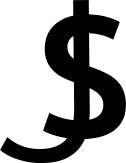

# WineApp

[![Stargazers][stars-shield]][stars-url]
[![Issues][issues-shield]][issues-url]
[![LinkedIn][linkedin-shield]][linkedin-url]
[![Instagram][instagram-shield]][instagram-url]

<!-- PROJECT LOGO -->
<br />
<p align="center">
  <a href="https://github.com/jasonn0118/WineApp">
    
  </a>

  <h3 align="center">Wine App</h3>

  <p align="center">
    This is a React web wine application
    <br />
    <a href="https://github.com/jasonn0118/WineApp"><strong>Explore the docs »</strong></a>
    <br />
    <br />
    <a href="https://distracted-lichterman-ed1426.netlify.app">View Live</a>
    ·
    <a href="https://github.com/jasonn0118/WineApp/issues">Report Bug</a>
    ·
    <a href="https://github.com/jasonn0118/WineApp/issues">Request Feature</a>
  </p>
</p>

<!-- TABLE OF CONTENTS -->
<details open="open">
  <summary>Table of Contents</summary>
  <ol>
    <li>
      <a href="#about-the-project">About The Project</a>
      <ul>
        <li><a href="#built-with">Built With</a></li>
        <li><a href="#installation">Installation</li>
      </ul>
    </li>
    <li><a href="#contact">Contact</a></li>
    <li><a href="#acknowledgements">Acknowledgements</a></li>
  </ol>
</details>

<!-- ABOUT THE PROJECT -->

## About the project

<!-- ScreenShot in here -->
[![WineApp Screen Shot][product-screenshot]](https://distracted-lichterman-ed1426.netlify.app/)
by clicking screenshot, you can check out a demo.

In this project, I mostly focus on refactoring the old version React and Redux.
Since I learned React, it has been many updates. So I decided to refactor the original using up-to-date React technology.

Here's why(in Detail):

- React features, especially Hooks, have been updated.
- React recommends to use functional component.
- React Router has been updated.
- Using Redux with recent React Hooks(`useSelector`) is way easier.

Here is the link for original project repo - [Wine App Tutorial](https://github.com/react-bootcamp/react-103)

### Built With

- [React](https://reactjs.org/)
- [Redux](https://redux.js.org/)
- [WineOpenAPI](https://wines-api.herokuapp.com/)

### Installation

1. Clone the repo
  ```sh
  git clone https://github.com/your_username_/Project-Name.git
  ```
2. Install NPM Packages

```sh
   npm install
```

3. Start the server
```sh
  npm start
```


<!-- CONTACT -->
## Contact

Jason Shin - [LinkedIn][linkedin-url] - tlswoals2006@gmail.com

Address: Vancouver, BC, 🇨🇦

Project Link: [https://github.com/jasonn0118/WineApp.git](https://github.com/jasonn0118/WineApp.git)


<!-- ACKNOWLEDGEMENTS -->

## Acknowledgements

- [GitHub Emoji Cheat Sheet](https://www.webpagefx.com/tools/emoji-cheat-sheet)
- [Img Shields](https://shields.io)
- [GitHub Pages](https://pages.github.com)
- [React](https://reactjs.org/)
- [Redux](https://redux.js.org/)
- [WineOpenAPI](https://wines-api.herokuapp.com/)
- [MaterialUI](https://material-ui.com/)
- [Netlify](https://www.netlify.com/)


[stars-shield]: https://img.shields.io/github/stars/jasonn0118/WineApp.svg?style=for-the-badge
[stars-url]: https://github.com/jasonn0118/WineApp/stargazers
[issues-shield]: https://img.shields.io/github/issues/jasonn0118/WineApp.svg?style=for-the-badge
[issues-url]: https://github.com/jasonn0118/portfolio/issues
[linkedin-shield]: https://img.shields.io/badge/-LinkedIn-black.svg?style=for-the-badge&logo=linkedin&colorB=555
[linkedin-url]: https://www.linkedin.com/in/jasonshin0118/
[instagram-shield]: https://img.shields.io/badge/Instagram-E4405F?style=for-the-badge&logo=instagram&logoColor=white
[instagram-url]: https://www.instagram.com/jasonn_dev/
[gmail-shield]: https://img.shields.io/badge/Gmail-D14836?style=for-the-badge&logo=gmail&logoColor=white
[product-screenshot]: public/overview.png